# 第1回 Next.js handson

## 概要

Next.jsを利用した、オリジナルのグルメ検索サービス開発を通して、Webアプリケーション開発を体験します。

## レジュメ

- 開発環境セットアップ
- Next.jsとは
- ルールに従ってコードを綺麗にする
- ハローワールドページを作成
- デプロイ
- CSSフレームワークを利用
- dev toolの活用
- 状態管理
- API
- SSRでデータ表示
- デザイン
- CSRデータ表示
- 他機能やデザインなどを考えて実装する

## 開発環境セットアップ

### フォーク

[ハンズオンリポジトリ](https://github.com/arakawamoriyuki/nextjs-handson)にアクセスし、フォークします。

フォークする際 `Copy the main branch only` のチェックを外してフォークしてください。

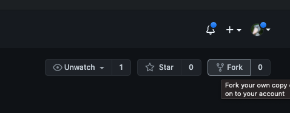

フォーク後、以下コマンドで作成した自分のリポジトリをクローンし、ハンズオン開始準備をしてください。(mainブランチをセットアップ状態に戻し、pushします)

```sh
$ git clone git@github.com:{自分のアカウント}/nextjs-handson.git
$ cd nextjs-handson
$ git merge origin/revert-part1-setup
$ git push origin main
```

自身でセットアップしたい場合は以下を参考にセットアップできますが、Mui導入など最低限のツール導入を行なっています。

https://nextjs.org/learn/basics/create-nextjs-app/setup

### 開発環境立ち上げ

以下コマンドを実行し、パッケージインストールとサーバー立ち上げを行います。

```sh
$ yarn
$ yarn dev
```

できたら以下にアクセスしてページが表示されるか確認しましょう。

http://localhost:3000/

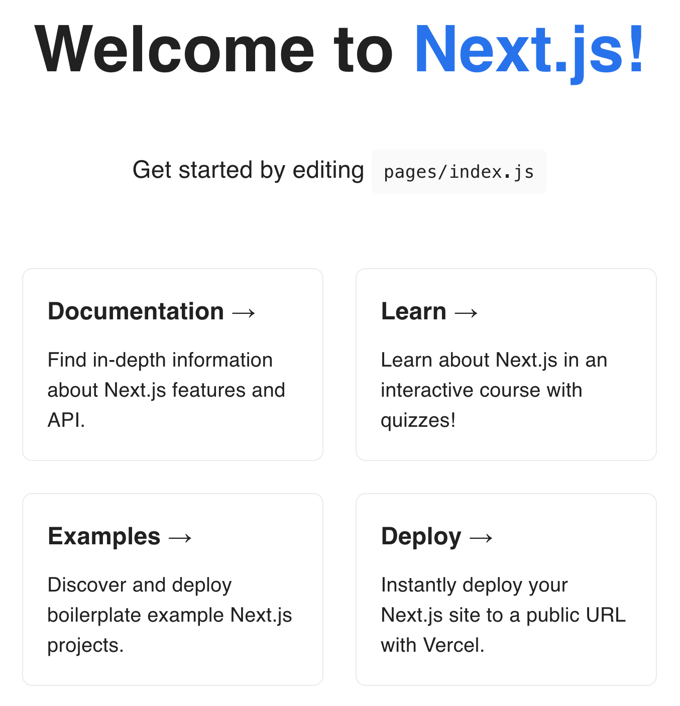

## Next.jsとは

- Webアプリケーション開発用のフレームワークでjavascriptやnodeで書ける
- フロントエンドのフレームワークであるReactが使える
- バックエンド側のAPIを作成する機能なども充実している
- 開発元が提供しているVercelというホスティングサービスと相性が良い

## ルールに従ってコードを綺麗にする

part0でエディタの設定が済んでいれば、コードを変更した際に自動で修正されるようになっています。

`pages/index.js` などに不要な改行を入れ、保存してみましょう。設定により自動整形されるか確認します。

設定は任意ですが、よくない書き方への警告や自動整形で開発をスムーズに進められるメリットがあります。

今は公式に乗っ取った最低限の設定ですが、以下の設定を変更したり、公開されているルールを適用してもいいでしょう。

- .eslintrc.json
- .prettierrc.js

## ハローワールドページを作成

next.jsでは `pages` 配下にコンポーネントを作成するとページとして表示されます。

`pages/part1/helloworld.js` を作成して確認してみましょう。

https://github.com/arakawamoriyuki/nextjs-handson/commit/ee6507ac7447e3b84adc998f23ba31e26ed62d41

`pages/part1/helloworld.js`
```js
import React from 'react';

const HelloWorld = () => {
  return (
    <div>
      <div>Welcome to Next.js!</div>
    </div>
  );
};

export default HelloWorld;
```

以下にアクセスしてページが表示されていればOKです。

http://localhost:3000/part1/helloworld

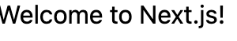

最後にgit pushでmainブランチにあげましょう。

## デプロイ

VercelというSaaSを利用して簡単にこのサイトを公開してみましょう。

まずはサインアップ https://vercel.com/signup

New Projectボタンを押して

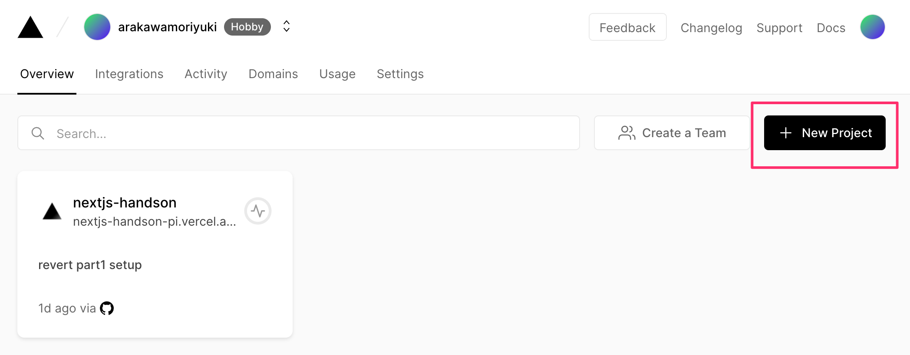

nextjs-handsonリポジトリをimportしてください

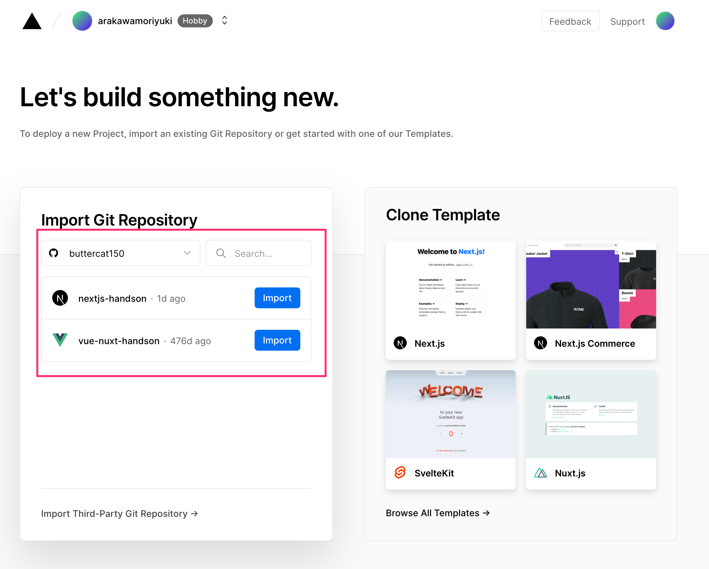

これでpushしたら自動でビルドされる環境が用意できました。

Visitをおしてサイトが表示されたら動作確認完了！

https://nextjs-handson.vercel.app/

## CSSフレームワークを利用

今回はMuiというCSSフレームワークを利用して、デザインを整えます。

https://mui.com/

いろいろなコンポーネントがあるのでみてみましょう。

https://mui.com/components/buttons/

### 用意されたコンポーネントを利用

Muiを利用した検索コンポーネントを作って表示してみましょう。

https://github.com/arakawamoriyuki/nextjs-handson/commit/6e2adaec26895ffeba9123c87a9af15f48377901

`pages/part1/mui.js`
```js
import React from 'react';
import Container from '@mui/material/Container';
import Box from '@mui/material/Box';
import TextField from '@mui/material/TextField';
import Button from '@mui/material/Button';

const Mui = () => {
  return (
    <Container component="main" maxWidth="xs">
      <Box component="form" noValidate>
        <TextField label="キーワードを入力してください" variant="standard" margin="normal" fullWidth />
        <Button variant="contained" margin="normal" fullWidth>
          検索
        </Button>
      </Box>
    </Container>
  );
};

export default Mui;
```

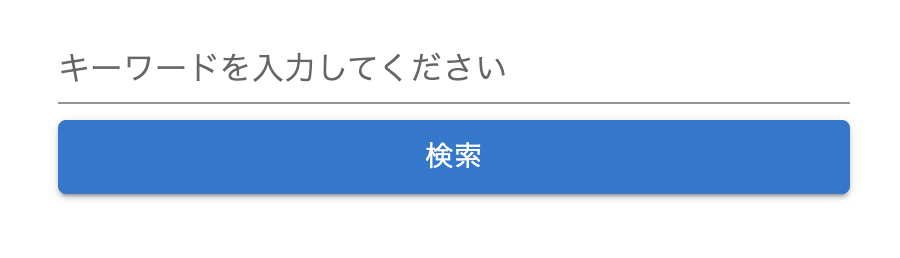

### styleの適用

表示を整える際に、こまかいstyleの調整を行いたい場面がでてきます。

いくつか方法があるのでみていきましょう。

まずはsxプロパティを使ってstyleを調整してみます。

themeで指定されている設定値を計算して反映してくれます。

[The sx prop - Mui](https://mui.com/system/the-sx-prop/)

https://github.com/arakawamoriyuki/nextjs-handson/commit/a884dc92d7a3133a3a75bba735848290ccea261f

`pages/part1/mui.js`
```diff
- <Box component="form" noValidate>
+ <Box component="form" noValidate sx={{ marginTop: 8 }}>
```

emotionを利用したCSSを当てたい場合の方法も見てみます。

https://github.com/arakawamoriyuki/nextjs-handson/commit/f82d81d24e06d01bb45fdd5358e3ce31b83644e5

`pages/part1/mui.js`
```diff
import React from 'react';
+ /** @jsxImportSource @emotion/react */
+ import { css } from '@emotion/react';
import Container from '@mui/material/Container';
import Box from '@mui/material/Box';
import TextField from '@mui/material/TextField';
import Button from '@mui/material/Button';

+ const styles = {
+   container: css`
+     background-color: red;
+   `,
+   box: css`
+     background-color: blue;
+   `,
+ };

const Mui = () => {
  return (
-     <Container component="main" maxWidth="xs">
-       <Box component="form" noValidate sx={{ marginTop: 8 }}>
+     <Container component="main" maxWidth="xs" css={styles.container}>
+       <Box
+         component="form"
+         noValidate
+         sx={{
+           marginTop: 8,
+           display: 'flex',
+           flexDirection: 'column',
+           alignItems: 'center',
+         }}
+         css={styles.box}
+       >
        <TextField label="キーワードを入力してください" variant="standard" margin="normal" fullWidth />
        <Button variant="contained" margin="normal" fullWidth>
          検索
```

[Style Library Interoperability - Mui](https://mui.com/guides/interoperability/)

いろいろなCSS適用方法がありますが、nextjsではSSRの関係でemotionが推奨されています。

以下優先順でつけるといいでしょう。

1. コンポーネントのプロパティ https://mui.com/api/button/
2. sxプロパティ https://mui.com/system/the-sx-prop/
3. emotion https://mui.com/guides/interoperability/#emotion

### themeの変更

Muiのテーマカラーを変更して、独自の色を持ったサイトを構築しましょう。

`pages/_app.js` は共通レイアウトを定義できるようになっているので、作成したテーマを全てのページに反映させます。

[Theming - Mui](https://mui.com/customization/theming/)

https://github.com/arakawamoriyuki/nextjs-handson/commit/fab3189861c1a136d5a3348dfff455c0265ee2b1

`styles/theme.js`
```js
import * as React from 'react';
import { createTheme } from '@mui/material/styles';
import { blue, purple } from '@mui/material/colors';

const theme = createTheme({
  palette: {
    primary: blue,
    secondary: purple,
  },
});

export default theme;
```

`pages/_app.js`
```diff
+ import App from 'next/app';
+ import Head from 'next/head';
+ import { ThemeProvider } from '@mui/material';
+ import CssBaseline from '@mui/material/CssBaseline';
+ import theme from '/styles/theme';
import '../styles/globals.css';

function MyApp({ Component, pageProps }) {
-   return <Component {...pageProps} />;
+   return (
+     <>
+       <Head>
+         <title>Next.js handson</title>
+       </Head>
+       <ThemeProvider theme={theme}>
+         <CssBaseline />
+         <Component {...pageProps} />
+       </ThemeProvider>
+     </>
+   );
}

export default MyApp;
```

他と区別するため、primary colorを変更してください

[Color - Mui](https://mui.com/customization/color/#main-content)

### デプロイ

ここまでできたらpushしてデプロイ、確認してみましょう。

## dev toolの活用

Webアプリケーション開発にはさまざまなデバッグが必要になります。それを助けてくれるのがブラウザにあるdev toolです。

Chromeを利用している場合、macの場合は `Command + option + i` 、windowsの場合は `Ctrl + Shift + i` で開くことができます。

また、Chrome以外でも同じようなdev toolがあるので調べてみてください。

### Elementsタブ

表示した要素で `右クリック` して `検証` でもOKです。

要素のcssを確認/変更したりできます。

コンポーネントはhtml標準要素に変換されていることにも注目しましょう。

直接cssの値を変更してみたり、margin/paddingなどの設定も確認できます。

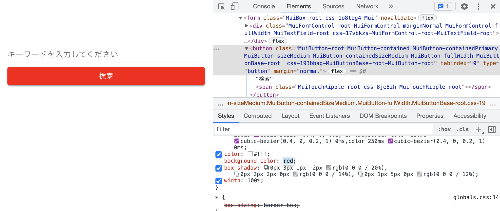

### Consoleタブ

ブラウザで起きたエラーや警告などを確認できます。

また、 `console.log()` で値の確認などができます。

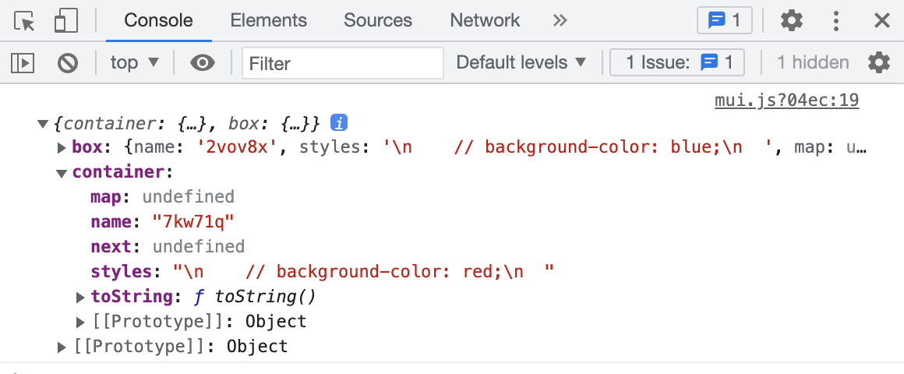

### Networkタブ

ブラウザで起きた通信内容のリクエスト/レスポンスを確認できます。

少し先になりますが、APIでデータを取得する時などに利用できます。


## 状態管理

Webページには静的ページと動的ページ、非同期通信を利用したSPAなどがあります。

静的ページは何も表示内容に動きがないページで毎回同じhtmlを返します。

動的ページはサーバー側でhtmlを組み立て、アクセスする度に最新の情報を表示することができます。また、セッションなどを利用してユーザー毎に違う内容を表示することも可能です。

SPAはブラウザからデータを取得し、ページ遷移することなくhtmlの一部を差し替えて表示することができます。これにより、何かしらのユーザーアクションに反応してページに動きを出し、UXを向上することができます。

Next.jsにはReact.jsというフレームワークが含まれていて、Reactの状態管理機能によってSPAを実装することができます。

[ステートフックの利用法 - React](https://ja.reactjs.org/docs/hooks-state.html)

利便性の高いWebアプリケーションを作るために重要な要素なので学習していきましょう。

### イベント処理 onClick/onChange

まずは状態を変更するためにイベントをどう制御するか確認する必要があります。

ReactではonClick/onChangeなどの属性でそれぞれの処理を定義することができます。

mui.jsをコピーしてstore.jsを作成、UI側のイベントを処理できることを確認してみましょう。

https://github.com/arakawamoriyuki/nextjs-handson/commit/f83cb4d23253df466805c78aeff2ecc02bfcc243

https://github.com/arakawamoriyuki/nextjs-handson/commit/893f2251d700deb7f0e28cd8ec5f96dff2c5102f

`pages/part1/store.js`
```diff
-         <TextField label="キーワードを入力してください" variant="standard" margin="normal" fullWidth />
-         <Button variant="contained" margin="normal" fullWidth>
+         <TextField
+           label="キーワードを入力してください"
+           variant="standard"
+           margin="normal"
+           fullWidth
+           onChange={(event) => {
+             console.log('input change', event.target.value);
+           }}
+         />
+         <Button
+           variant="contained"
+           margin="normal"
+           fullWidth
+           onClick={() => {
+             console.log('button click');
+           }}
+         >
```

作成したページを見て以下動作になっているか確認してみましょう

- キーワード入力した際に入力した値がconsoleに出ているか確認
- 検索ボタンを押した時に `button click` がconsoleに出ているか確認

### ページの状態を作る React.useState

ReactのuseStateを使い、状態を保存できるようにします。

ここでは、フォームに入力されたキーワードを変更したり、リセットしてみましょう。

https://github.com/arakawamoriyuki/nextjs-handson/commit/3cd2569ca8d158efb69dff435abf6a9777e3eb3f

`pages/part1/store.js`
```diff
const Store = () => {
+   const [keyword, setKeyword] = React.useState('');

  return (
...
+           value={keyword}
          onChange={(event) => {
-             console.log('input change', event.target.value);
+             setKeyword(event.target.value);
          }}
...
          onClick={() => {
-             console.log('button click');
+             setKeyword('');
          }}
```

さらに今の状態の値を表示して確認できるようにしてみます。

https://github.com/arakawamoriyuki/nextjs-handson/commit/9c70580e0d82e372212e164f94b4abba681f274c

`pages/part1/store.js`
```diff
import Button from '@mui/material/Button';
+ import Typography from '@mui/material/Typography';

const Store = () => {
...
        }}
      >
+         <Typography>検索ワード: {keyword}</Typography>
        <TextField
          label="キーワードを入力してください"
```

keywordという状態を作って、TextFieldの値にセットしています。

テキストフィールドでは、変更された値をsetKeywordで変更しています。

検索ボタンは、押されると値をリセットするようsetKeywordで変更しています。

これにより、keywordがsetKeywordで変更された際に自動的に画面が更新(再レンダリング)されます。

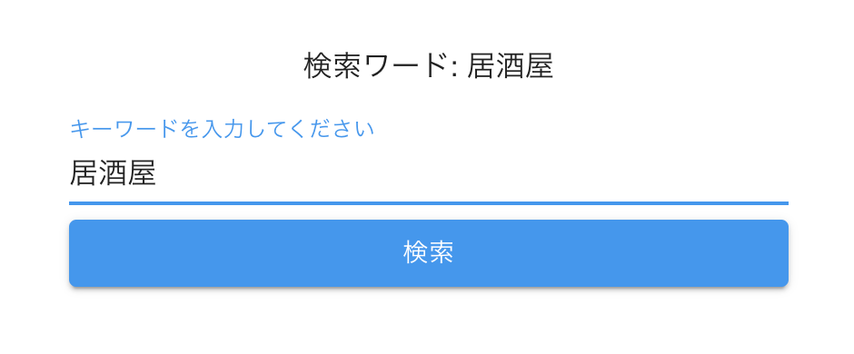

### デプロイ

ここまでできたらpushしてデプロイ、確認してみましょう。

## API

### ホットペッパーAPIについて

グルメ検索サービスを開発するにあたって、ホットペッパーのグルメサーチAPIを利用します。

細かい仕様はドキュメントを確認してみましょう。

[グルメサーチAPIリファレンス - リクルート](https://webservice.recruit.co.jp/doc/hotpepper/reference.html)

### ホットペッパーAPI APIキー排出

ここでメールアドレスを登録してAPIキーを取得して下さい

https://webservice.recruit.co.jp/register/

APIキーを取得して、下記のAPIたたければ確認OKです。

```
https://webservice.recruit.co.jp/hotpepper/gourmet/v1/?key={APIキー}&large_area=Z011&format=json
```

### 環境変数設定

APIリクエスト時に使う環境変数を設定します。

https://github.com/arakawamoriyuki/nextjs-handson/commit/a2754ec43975484ef549807a9bf005c923914d68

.env(nextが読み込んでくれる環境変数)を作成し、先ほどのAPIキーを設定します。

`.env`
```
HOTPEPPER_API_KEY=xxxxx
```

コミットしないように.gitignoreに.envを追加してください。

`.gitignore`
```diff
# local env files
+ .env
.env.local
```

次に環境変数をnextで読み込むconfigに設定します。

それぞれRuntimeConfigは以下用途に使うといいでしょう。

- publicRuntimeConfigは基本的に漏れても良い設定値(ブラウザ側で利用するので漏れる)
- serverRuntimeConfigは漏れてはいけないサーバー側で利用する値(APIキーなど)

また、VERCEL_URLはvercelでデプロイした際に環境変数として付与される `my-site-7q03y4pi5.vercel.app` などのホスト名です。

本番環境と開発環境でのAPIリクエスト先として設定します。

[Environment Variables - Vercel](https://vercel.com/docs/concepts/projects/environment-variables)

`next.config.js`
```diff
+ const { VERCEL_URL, HOTPEPPER_API_KEY } = process.env;
+
module.exports = {
  reactStrictMode: true,
- }
+   publicRuntimeConfig: {
+     API_HOST: VERCEL_URL ? `https://${VERCEL_URL}` : 'http://localhost:3000',
+   },
+   serverRuntimeConfig: {
+     HOTPEPPER_API_KEY,
+   },
};
```

また、環境変数の読み込みに再起動が必要です。

### ラッパーAPI作成

#### ラッパーAPIを作る理由

フロント(ブラウザ)側でホットペッパーAPIへリクエストすることもできますが、その際にAPIキーが漏れてしまいます。

その場合、コード上やdev toolのnetworkタブなどで利用者がAPIキーを見つけ、不正に利用されてしまいます。

サーバー側でリクエストし、ブラウザに漏れないように実装する必要があります。

#### pages/api/shops.js を作成

pages/apiディレクトリの中に `shops.js` を作ってみましょう。

コンポーネントを返してhtmlを表示することもできますが、APIとしてJSONを返すこともできます。

https://github.com/arakawamoriyuki/nextjs-handson/commit/c731560d4971cce0119a93c22fe16857afa918d6

`pages/api/shops.js`
```js
import getConfig from 'next/config';

const shops = async (req, res) => {
  const { HOTPEPPER_API_KEY } = getConfig().serverRuntimeConfig;

  const query = new URLSearchParams();
  query.set('key', HOTPEPPER_API_KEY);
  query.set('format', 'json');
  query.set('large_area', req.query.large_area || 'Z011');
  if (req.query.keyword) query.set('keyword', req.query.keyword);

  const response = await fetch(`https://webservice.recruit.co.jp/hotpepper/gourmet/v1/?${query.toString()}`);
  const data = await response.json();

  return res.json(data.results.shop);
};

export default shops;
```

グルメサーチAPIの仕様に従って、APIキーやフォーマット、エリアを指定、また、キーワードを任意で設定できるようにしています。

実際にリクエストして確認してみましょう。

- http://localhost:3000/api/shops
- http://localhost:3000/api/shops?large_area=Z098
- http://localhost:3000/api/shops?large_area=Z098&keyword=ラーメン

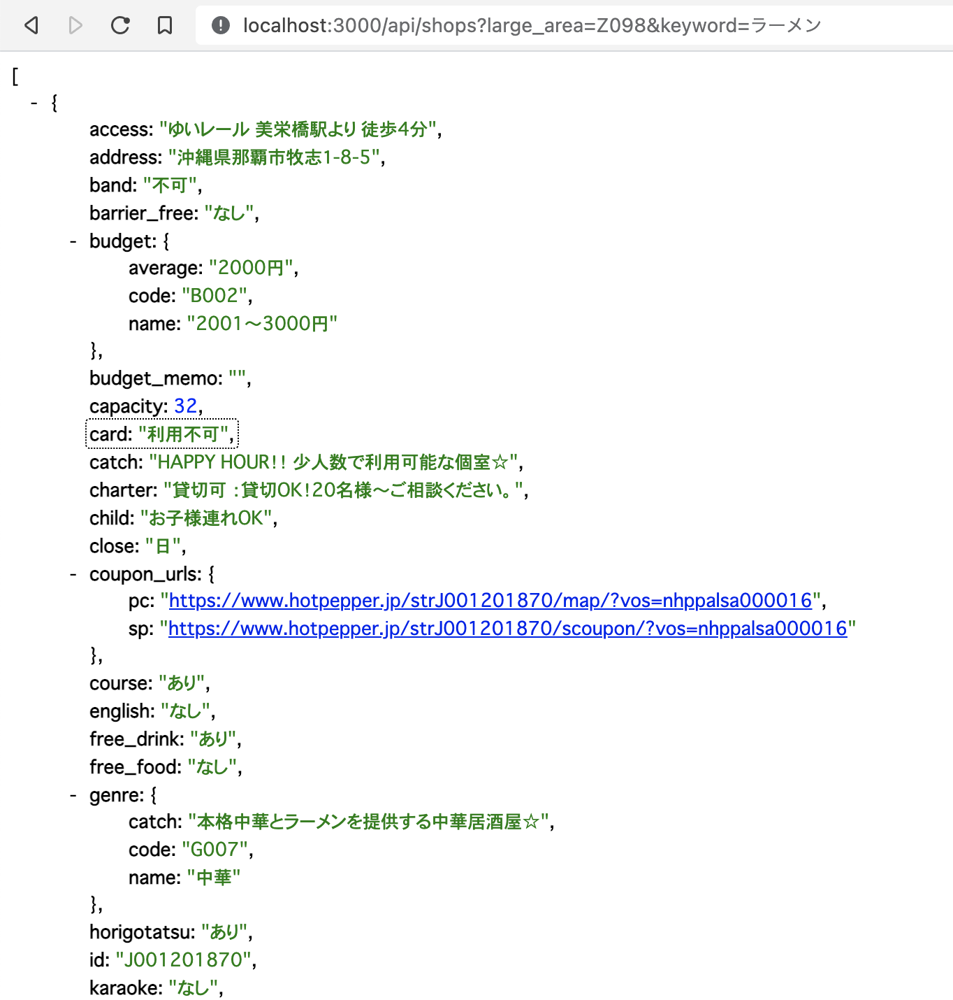

ちなみに `large_area` は以下で確認できます。

```
http://webservice.recruit.co.jp/hotpepper/large_area/v1/?key={APIキー}&format=json
```

デフォルトで東京の `Z011` になっていますが、沖縄の `Z098` に変更してもいいでしょう。

### デプロイ

環境変数 `HOTPEPPER_API_KEY` はvercelにも設定する必要があります。

`Settings > Environment Variables` から値を設定後、pushしてデプロイ、確認してみましょう。


## SSRでデータ表示

### SSRやCSRとは

nextの特徴でもあるレンダリング方法で、いくつか種類があります。

- SSR(Server Side Rendering) サーバー側でデータ取得、htmlを組み立て返す。動的に変化しないデータ取得や初期表示に使う
- CSR(Client Side Rendering) クライアント(ブラウザ)側でデータ取得、htmlを組み立てて更新する。動的にページを更新したい時に使う
- SSG(Static Site Generation) ビルド時にデータをfetchし、htmlを組み立てキャッシュする。早い。FAQなど動きのない静的ページに使う
- ISR(Incremental Static Regeneration) キャッシュ期間を指定するSSG

[Data Fetching Overview - Next](https://nextjs.org/docs/basic-features/data-fetching/overview#incremental-static-regeneration)

どれがいいというものではなく、適宜適切な方法を選べるといいでしょう。

今回は主にSSRとCSRを利用した例を紹介します。

### SSRでの実装方法

まずはSSRで(サーバーサイドでデータを組み立てて)初期表示として店舗名の単純なリストを表示してみましょう。

https://github.com/arakawamoriyuki/nextjs-handson/commit/a85fa12a16c900c6d44ff5d28363791df946a072

`pages/part1/gourmets.js`
```js
import React from 'react';
import getConfig from 'next/config';

const fetchData = async (keyword) => {
  const { API_HOST } = getConfig().publicRuntimeConfig;

  const query = new URLSearchParams();
  if (keyword) query.set('keyword', keyword);

  const host = process.browser ? '' : API_HOST;
  const res = await fetch(`${host}/api/shops?${query.toString()}`);
  return await res.json();
};

const Shops = ({ shops }) => {
  return (
    <ul>
      {shops.map((shop) => {
        return <li key={shop.id}>{shop.name}</li>;
      })}
    </ul>
  );
};

export const getServerSideProps = async (req) => {
  const data = await fetchData(req.query.keyword);

  return {
    props: {
      shops: data,
    },
  };
};

export default Shops;
```

- Shopsが引数を受け取るようになっていて、その値(ショップ情報配列)をループで回し、liを作っている。
- `getServerSideProps` を定義することにより、Shopsに引数を渡す。
- `?keyword=ラーメン` のようなURLクエリを受け取り、 `fetchData` に渡している。
- `fetchData` は先ほど作った `GET /api/shops` を呼び出し、その結果を返す

リストで店舗名が表示されているか、また、keywordパラメータを指定した場合に反映されているか確認しましょう。

- http://localhost:3000/part1/gourmets
- http://localhost:3000/part1/gourmets?keyword=ラーメン

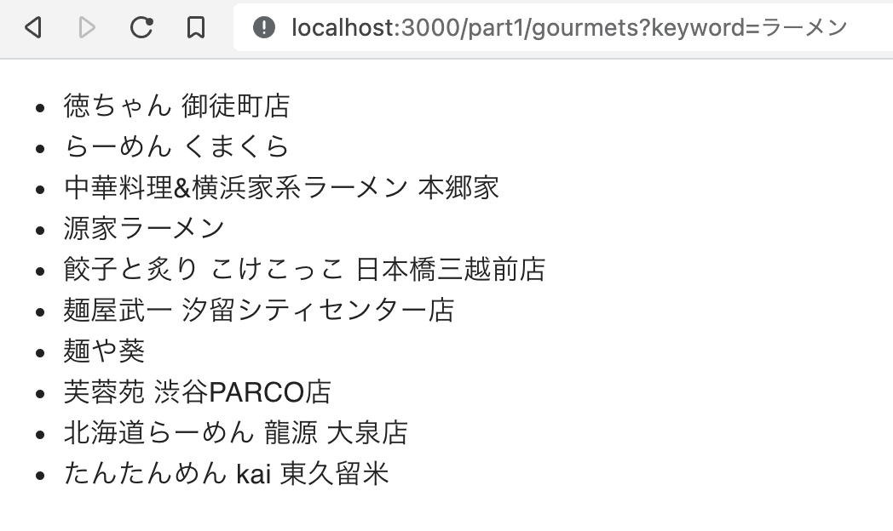

### デプロイ

ここまでできたらpushしてデプロイ、確認してみましょう。

## デザイン

### リストデザイン整える

現状はそっけないul,liでの実装なのでMUIでデザインを整えましょう。

https://github.com/arakawamoriyuki/nextjs-handson/commit/dd0b9c2cf8fe1d18c4d7da7938146d7993b3106b

`pages/part1/gourmets.js`
```diff
import React from 'react';
import getConfig from 'next/config';
+ import Container from '@mui/material/Container';
+ import Box from '@mui/material/Box';
+ import Typography from '@mui/material/Typography';
+ import List from '@mui/material/List';
+ import ListItem from '@mui/material/ListItem';
+ import ListItemButton from '@mui/material/ListItemButton';
+ import ListItemText from '@mui/material/ListItemText';
+ import ListItemAvatar from '@mui/material/ListItemAvatar';
+ import Avatar from '@mui/material/Avatar';

const fetchData = async (keyword) => {
...
const Shops = ({ shops }) => {
  return (
-     <ul>
-       {shops.map((shop) => {
-         return <li key={shop.id}>{shop.name}</li>;
-       })}
-     </ul>
+     <Container component="main" maxWidth="md">
+       <Box
+         component="form"
+         noValidate
+         sx={{
+           marginTop: 8,
+           display: 'flex',
+           flexDirection: 'column',
+           alignItems: 'center',
+         }}
+       >
+         <List>
+           {shops.map((shop) => {
+             return (
+               <ListItem key={shop.id}>
+                 <ListItemButton
+                   onClick={() => {
+                     // TODO: goto shop detail
+                   }}
+                 >
+                   <ListItemAvatar>
+                     <Avatar alt={shop.name} src={shop.logo_image} />
+                   </ListItemAvatar>
+                   <ListItemText
+                     primary={`${shop.genre.name} ${shop.name}`}
+                     secondary={
+                       <>
+                         <Typography variant="body1" component="span">
+                           {`${shop.catch} ${shop.shop_detail_memo}`}
+                         </Typography>
+                         <Typography variant="caption">{shop.address}</Typography>
+                       </>
+                     }
+                   />
+                 </ListItemButton>
+               </ListItem>
+             );
+           })}
+         </List>
+       </Box>
+     </Container>
+   );
```

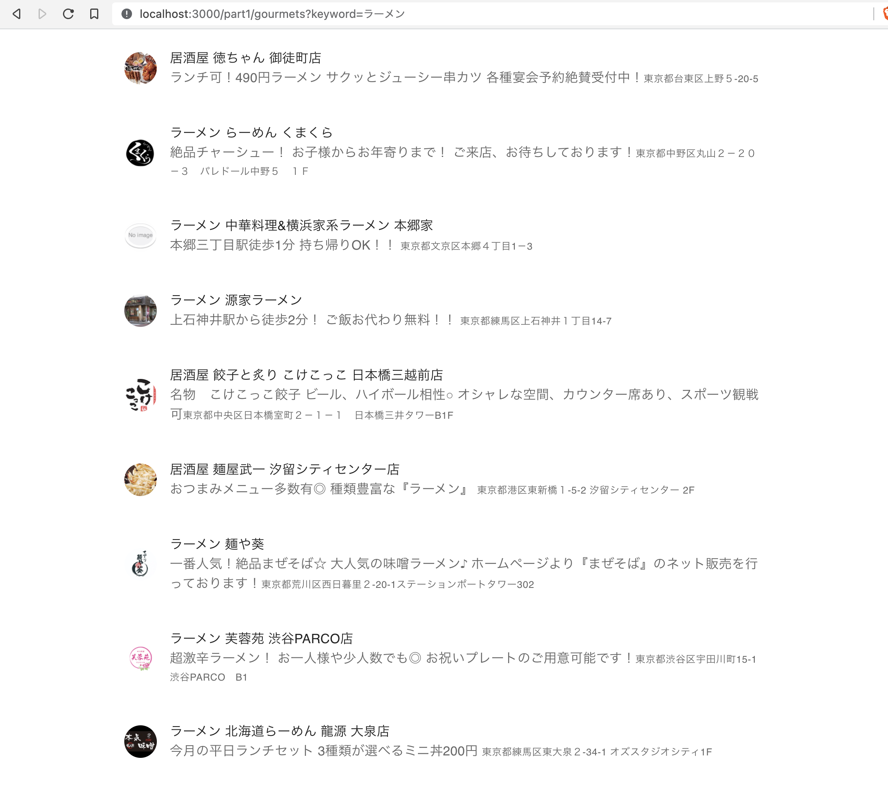

### 検索フォームデザイン整える

さらに検索フォームのUIを作って動的にリストに反映させる準備をしておきます。

https://github.com/arakawamoriyuki/nextjs-handson/commit/9433180e3cce8c26b903a108139153965873051a

`pages/part1/gourmets.js`
```diff
import Box from '@mui/material/Box';
+ import TextField from '@mui/material/TextField';
+ import Button from '@mui/material/Button';
import Typography from '@mui/material/Typography';
...
const Shops = ({ shops }) => {
+   const [keyword, setKeyword] = React.useState('');
+
  return (
    <Container component="main" maxWidth="md">
+       <Box
+         component="form"
+         noValidate
+         maxWidth="md"
+         sx={{
+           marginTop: 8,
+           display: 'flex',
+           flexDirection: 'column',
+           alignItems: 'center',
+         }}
+       >
+         <TextField
+           label="キーワードを入力してください"
+           variant="standard"
+           margin="normal"
+           fullWidth
+           value={keyword}
+           onChange={(event) => {
+             setKeyword(event.target.value);
+           }}
+         />
+         <Button
+           variant="contained"
+           margin="normal"
+           fullWidth
+           onClick={() => {
+             setKeyword('');
+           }}
+         >
+           検索
+         </Button>
+       </Box>
      <Box
        component="form"
        noValidate
```

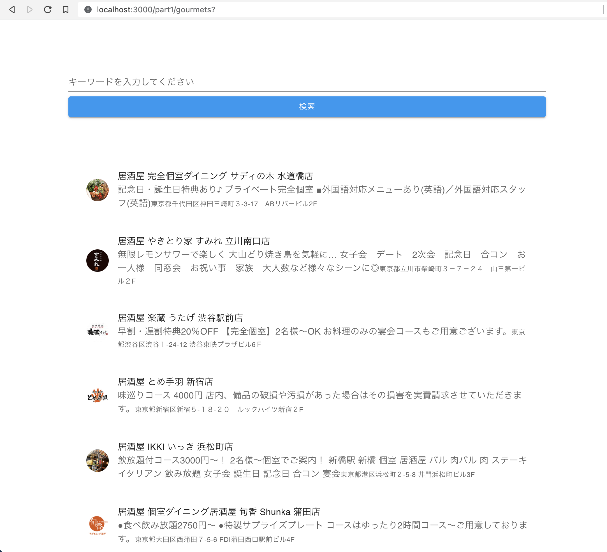

## CSRでデータ表示

### イベントと状態制御

今まではSSRで表示を変えていましたが、検索フォームで検索を押した際に動的にリストが更新されるように修正してみましょう。

まずは、動的にリストを変更できるようにするため、shopsを状態管理します。

https://github.com/arakawamoriyuki/nextjs-handson/commit/aacbc4159febbb2b4581b531f131715825a56846

`pages/part1/gourmets.js`
```diff
- import React from 'react';
+ import React, { useEffect } from 'react';
import getConfig from 'next/config';
...
- const Shops = ({ shops }) => {
+ const Shops = ({ firstViewShops }) => {
  const [keyword, setKeyword] = React.useState('');
+   const [shops, setShops] = React.useState([]);
+
+   useEffect(() => {
+     setShops(firstViewShops);
+   }, [firstViewShops]);

  return (
...
export const getServerSideProps = async (req) => {
  const data = await fetchData(req.query.keyword);

  return {
    props: {
-       shops: data,
+       firstViewShops: data,
    },
  };
};
```

SSRで取得するpropsをfirestViewShopsにリネームし、useEffectでセットするように変更しています。

useEffectはコンポーネントのマウント/アンマウントやpropsが変更された時の動作、ライフサイクルを定義できます。

[副作用フックの利用法 - React](https://ja.reactjs.org/docs/hooks-effect.html)

* Tips: 今回はコンポーネント分割していないが、propsはSSRから受け取るだけではなく、親コンポーネントから受け取ることもあり、useEffectはその値が変更された時の動作などを定義でます

### CSRでデータ取得

shopsを状態として管理できるようになったのでCSRでデータ取得し、反映させてみましょう。

https://github.com/arakawamoriyuki/nextjs-handson/commit/76d49a7fe2436fbd9645c4d824baed5fa039666a

```diff
  }, [firstViewShops]);

+   const onSearchClick = async () => {
+     const data = await fetchData(keyword);
+
+     setShops(data);
+     setKeyword('');
+   };
+
  return (
    <Container component="main" maxWidth="md">
...
          margin="normal"
          fullWidth
          onClick={() => {
-             setKeyword('');
+             onSearchClick();
          }}
        >
          検索
```

検索ボタンをクリックした時に、セットされているキーワードを利用してクライアント(ブラウザ)側でデータ取得するようになりました。

devtoolのNetworkタブも確認して、検索時にAPIリクエストされているか、そのリクエストやレスポンス内容も確認してみましょう。

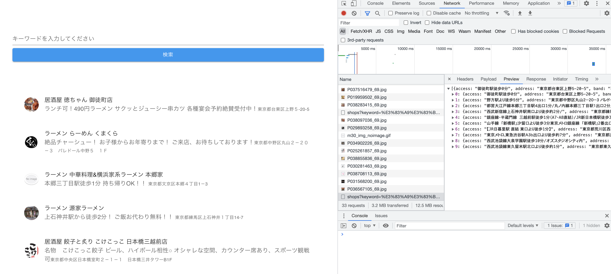

### デプロイ

ここまでできたらpushしてデプロイ、確認してみましょう。

## 他機能やデザインなどを考えて実装する

TOPページ `pages/index.js` を書き換えて自由にオリジナルのグルメ検索サービスを作ってください。

part1で作ったものをベースにしても大丈夫です。

どういうものを作りたいか企画/設計し、メンターに報告し、実装してみましょう。

- Lv1 デザイン 一覧ページのデザイン改修、持っている他のデータ表示
- Lv1 デザイン 詳細ページの作成
- Lv1 デザイン サイドメニューを追加
- Lv2 価格帯を制限して表示するなど、独自の特化したグルメ検索サービスにする
- Lv2 ジャンル/地域などを固定値で選択できるフォームで表示、指定
- Lv2 localStorageを利用した検索条件の保持
- Lv3 ジャンル/地域などをマスタデータAPIで取得してフォームで表示、指定
- Lv3 ページング
- Lv4 LocationAPIを利用した現在地から絞り込み
